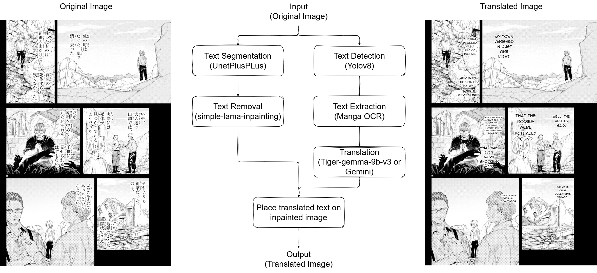
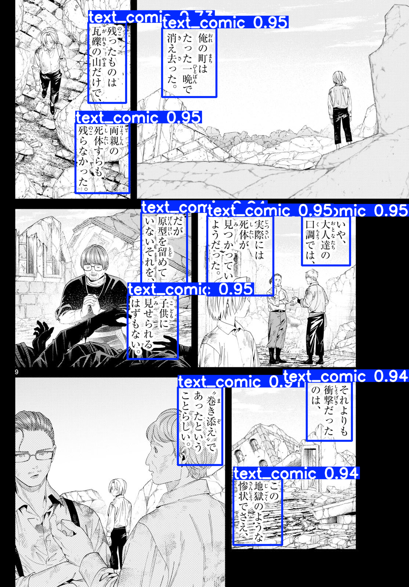
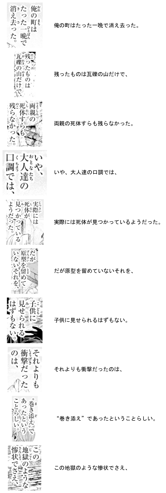
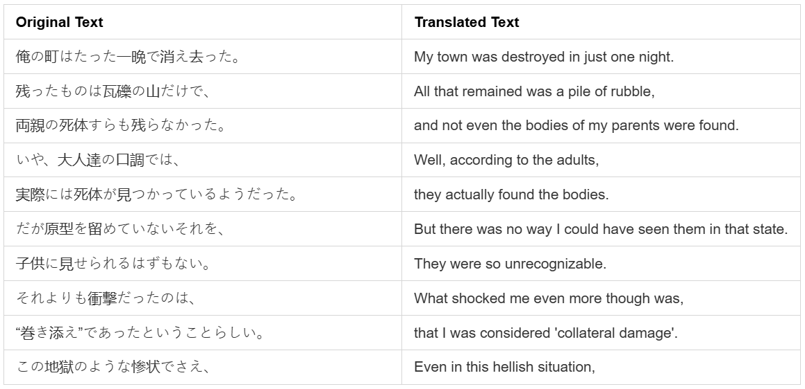
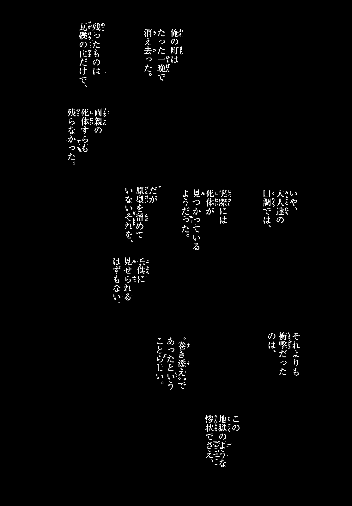
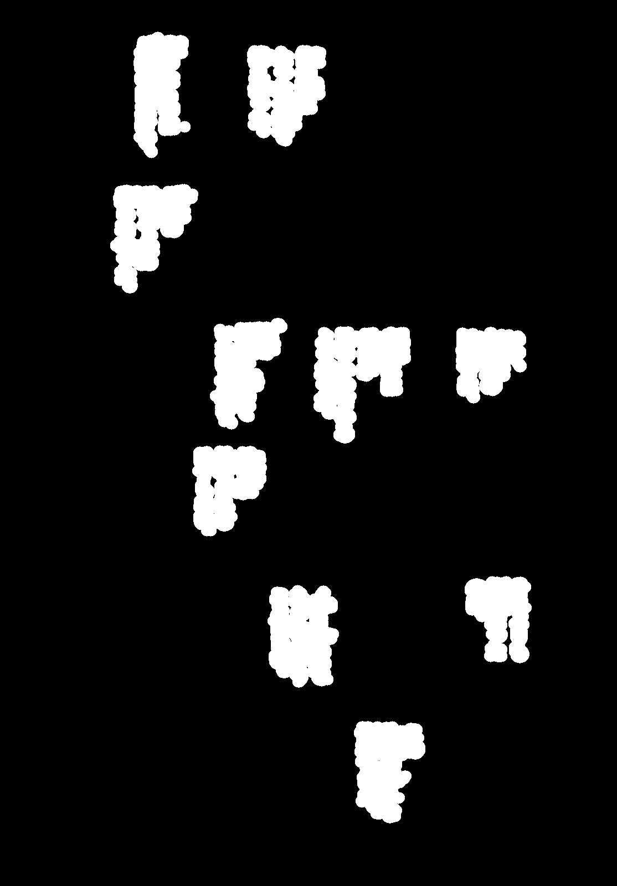
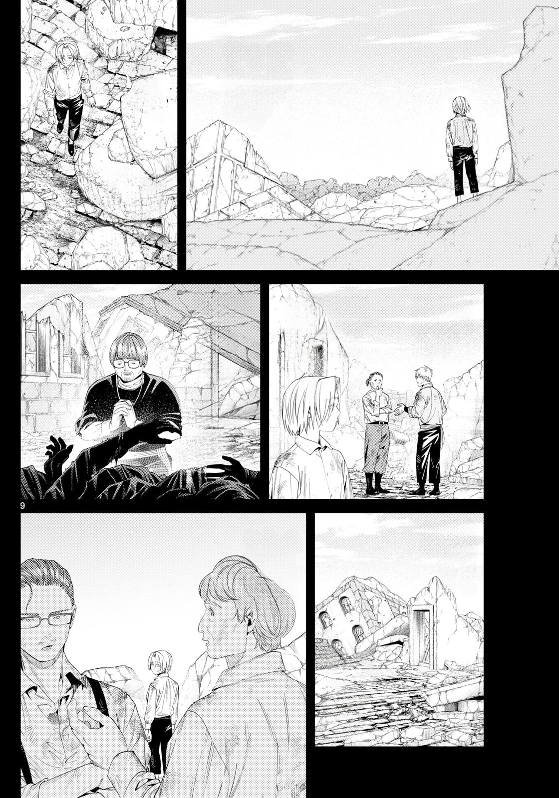
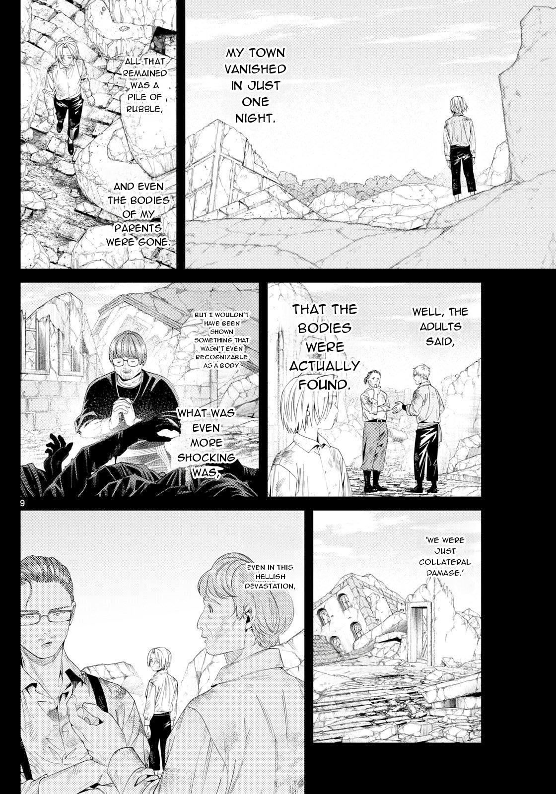

# Manga Translator App

This repository contains the source code for an automated manga translationapplication. The core of this project is a complete local AI pipeline designed to detect, erase, extract, and translate Japanese text from manga, before seamlessly rendering the translated text back into the original regions.

## Video Demo
<div align="center">
  <video src="doc/videos/demo.mp4" width="80%" controls autoplay loop muted playsinline></video>
  <br>
  <i>In-app translation process: from raw Japanese scan to fully translated page.</i>
</div>

## Prerequisites
- **Python**: 3.11. (only for running from source, not required if using the pre-built .exe)
- **Hardware**: An NVIDIA GPU is **highly recommended**. 
  - To run the **Local LLM (`tiger-gemma-9b-v3`)**, you need at least **12GB+ of VRAM** (you can use other models that have smaller parameter to reduce VRAM usage but it will affect translation performance).
  - If using the **Gemini API** for translation, a GPU with **4GB+ VRAM** is sufficient for the OCR and Inpainting models.

> [!NOTE]
> **My Hardware Setup**:
> - **GPU:** NVIDIA GeForce RTX 3060 (12GB VRAM)
> - **RAM:** 32GB
> - **VRAM Consumption:** Running the entire pipeline with local LLM (`tiger-gemma-9b-v3` loaded in 4-bit quantization) consumes **almost the entire 12GB of VRAM**.

## Installation

1. **Clone the repository:**
   ```bash
   git clone https://github.com/BLonggg608/manga-translate-app.git
   cd manga-translate-app
   ```

2. **Install Python dependencies:**
   ```bash
   pip install -r requirements.txt
   ```

3. **Download and structure model files:**
   Ensure you have downloaded the necessary model weights and placed them in the `models/` directory following this exact structure:
   - `models/simple-lama-inpainting/anime-manga-big-lama.pt`
   - `models/text-detector/comic-text-segmenter.pt`
   - `models/text_segmentation/model.pth`
   - `models/text_ocr/models/manga-ocr-base/`
   - `models/translate-model/models/tiger-gemma-9b-v3/` (If using the Local LLM engine)

## Usage

**Running from source:**
Activate your Python environment and run the main entry point:
```bash
python app/main.py
```

## Building for Windows (.exe)

If you want to package the application into a standalone Windows executable:
1. Ensure all dependencies are installed.
2. Run the provided smart build script:
   ```cmd
   build_exe.cmd
   ```

## Pipeline

Here is a overview of the fully automated manga translation pipeline:




1. **Text Detection**: 
   - A fine-tuned **`YOLOv8`** model to locate text and draw bounding boxes around text regions inside the manga panel. The purpose of this step is to identify where the text is located on the manga page, which will be used for OCR step.
   - This repo is using weights from the [ogkalu/comic-text-segmenter-yolov8m](https://huggingface.co/ogkalu/comic-text-segmenter-yolov8m/tree/main) repository on Hugging Face. Although the model is trained for text segmentation, the output of the model has both bounding box and segmentation mask, so I can use the bounding box output for text detection.
   <p align="center">
      
      <br>
      <i>Text Detection Output</i>
   </p>

2. **Text Extraction (Optical Character Recognition - OCR)**: 
   - After detecting bounding boxes of text regions, the pipeline uses **`Manga OCR`** model (the details can be found in the [kha-white/manga-ocr](https://github.com/kha-white/manga-ocr) repository on GitHub) to extract the Japanese text.
   - This repo has refined the code to load the model from local directory.
   <p align="center">
      
      <br>
      <i>Text Extraction Output</i>
   </p>

3. **Translation**: 
   - Translates the extracted Japanese text into the target language. The pipeline supports offline contextual translation using a Local LLM (**`tiger-gemma-9b-v3`** loaded with 4-bit quantization via BitsAndBytes) or via Gemini API.
   - By default, this repo uses **`tiger-gemma-9b-v3`** ([TheDrummer/Tiger-Gemma-9B-v3](https://huggingface.co/TheDrummer/Tiger-Gemma-9B-v3)). After experimenting with various models (such as `Qwen2.5-7B`, `Llama-3.1-8B`, and the base `Gemma-2-9B`), I personally found that the Gemma-2 architecture delivers the best translation quality. I chose **`tiger-gemma-9b-v3`** because it is a decensored model that can handle any manga genre seamlessly without censorship blocks.That said, you are completely free to use any other Hugging Face LLMs if you prefer.
   <p align="center">
      
      <br>
      <i>Translation Output</i>
   </p>
   
4. **Text Segmentation**: 
   - Generates a precise, pixel-level binary mask of the text using a **`UnetPlusPlus`** model with an **`EfficientNetV2`** encoder. While **`YOLOv8`** is capable of segmentation, its masks tend to be coarse, often blanketing the entire text block within a bounding box like a solid blob. In contrast, **`UnetPlusPlus`** is explicitly used here because it isolates the exact strokes and shapes of individual characters without bleeding into the background. The resulting binary mask is crucial for the later **Inpainting** phase, allowing the pipeline to cleanly erase the original Japanese text without damaging the surrounding manga artwork.
   - Under the hood, this implementation of the model and weights are from the [`a-b-c-x-y-z/Manga-Text-Segmentation-2025`](https://huggingface.co/a-b-c-x-y-z/Manga-Text-Segmentation-2025/tree/main) repository on Hugging Face.
   <p align="center">
      
      <br>
      <i>Text Segmentation Output</i>
   </p>

5. **Inpainting (Text Removal)**: 
   - Before passing the highly precise binary mask to the inpainting engine, the pipeline applies a morphological **dilation** operation. This slightly expands the mask's boundaries to encompass not just the core strokes, but also any surrounding anti-aliasing pixels or compression artifacts.
   - Once dilated, the model seamlessly erases the Japanese text region without leaving any faint outlines or "ghosting". It intelligently "hallucinates" and reconstructs the missing background details (such as screentones, action lines, or character hair) to make the panel look completely blank and natural.
   - This implementation relies on the [simple-lama-inpainting](https://github.com/enesmsahin/simple-lama-inpainting) library for the core inpainting engine. To optimize specifically for manga and anime art styles, the pipeline uses the specialized `anime-manga-big-lama.pt` weights provided by the [AnimeMangaInpainting](https://github.com/Sanster/models/releases/tag/AnimeMangaInpainting) release.
   <p style="width: 1000px; text-align: center; margin: auto;">
      
      
      
      <br>
      <i>Text Removal Output (Left: Original, Middle: Dilated Mask, Right: Cleared)</i>
   </p>

6. **Insert Translated Text**: 
   - In the final step, the translated text is rendered directly onto the newly inpainted (blank) manga panel. The text is placed back into the original bounding box locations using a *Anime Ace* font to maintain the authentic look and feel of a translated manga.
   <p style="width: 800px; text-align: center; margin: auto;">
      
      
      <br>
      <i>Last Output (Left: Original, Right: Translated)</i>
   </p>
